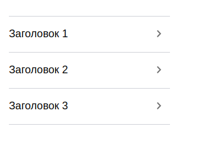
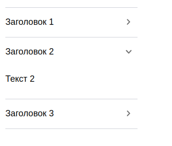

# Lab2 (React.js)

## Установка зависимостей:
```
npm i
```

## Запуск проекта:
```
npm start
```

## Содержание:
Акордион содержит props:

название | тип   | required | default | описание
:--------|:------|:--------:|:-------:|--------:
data | array |  | | массив данных


Пример использования данных props:

```react
  <AccordionComponent data={data_2}/>
```

Пример массива данных
```react
export const data_1 =[
    {
        id : 1,
        title : "Заголовок 1",
        text : "Текст 1"
    },
    {
        id : 2,
        title: "Заголовок 2",
        text : "Текст 2"
    },

]
```

Метод открытия и закрытия акордиона
```react
 const handleClick = event =>{
        setActive(!active)
        setRotate(active ? "accordion__icon" : "accordion__icon rotate")
        setHeightContent(active ? "0px" : `${content.current.scrollHeight}px`)
    }
```


## Приложение в работе:

В закрытом виде:



В открытом виде:

