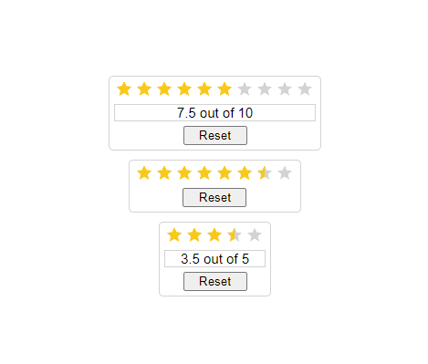
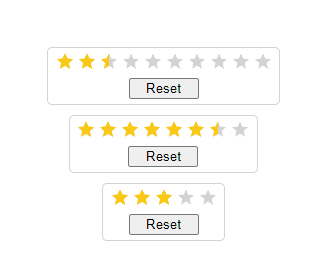
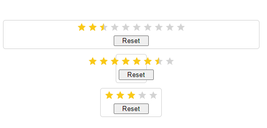

# Star-rating

## Star-rating attributes

|Attribute|Description|Type|Default|
|:-:|:-:|:-:|:-:|
|modelValue|Rating value at the start|Number|0|
|starLimit|Number of stars|Number|5|
|isCount|Counter under star rating|Boolean|false|
|widthContainer|Width of star rating container|String|""|

### Rating computed
|Computed|Description|
|:-:|:-:|
|ratingHoverWidth|Calculation of the width of the rating bar on hover (in percent)|
|ratingWidth|Calculation of the width of the rating bar when clicked (in percent)|
|viewRating|Numerical indicator of how many stars are clicked or hovered over|

### Rating methods
|Method|Description|
|:-:|:-:|
|onMouse|Mouse hover events on stars|
|onMouseLeave|Decimal pointing event (between stars)|
|setRating|Setting rating on click|
|setDecimal|Setting decimal rating on click|
|resetHover|Reset mouse hover|
|resetRating|Rating reset|

### Rating buttons
Reset - сброс рейтинга

###### Пример работы звездного рейтинга с надписью снизу

 

###### Пример работы звездного рейтинга без надписи

 

###### Пример, когда размер контейнера задается вручную, а не рассчитывается автоматически

 

