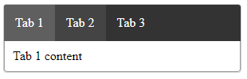
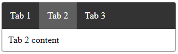

# Tabs

## Basic usage
```vue
<template>
  <div>
    <Tabs :tabs="tabs1" :active-tab-index="activeTab"></Tabs>
  </div>
</template>
  
<script>
import Tabs from './components/Tabs10.vue';
  
export default {
  components: {
      Tabs
  },
  data() {
    return {
      tabs1: [
        { title: 'Tab 1', content: 'Tab 1 content' },
        { title: 'Tab 2', content: 'Tab 2 content' },
        { title: 'Tab 3', content: 'Tab 3 content' },
      ],
      activeTab: 0
    }
  },
}
</script>
```

## Resulting Tabs component will look like this:
### Regular Tabs with mouse hover

### Tab changed


## Tabs Attributes

|Attribute|Description|Type|Accepted Values|Default|
|:-:|:-:|:-:|:-:|:-:|
|tabs|data source|Array|—|—|
|active-tab-index|index of selected tab|Number|—|0|

___
## Tabs Events
|Event Name|Description|Parameters|
|:-:|:-:|:-:|
|tabSwitched|triggers when tab was switched|index - index of new selected tab|