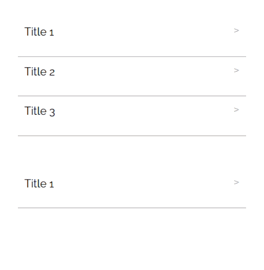

# Accordion Component:



# Props:

| name           | type              | comments                                                    |
|----------------|-------------------|-------------------------------------------------------------|
| elems          | Array of Objects  | Object has fields title and info.                           |
| activeElems    | Array of booleans | True means that element is open, false - element is closed. |
| infoArrayIndex | Number            | Index of this accordion instance.                           |

# Emits :

updateElement is emitted on click on the title block of the element, passes an Object with fields aIndex=infoArrayIndex
and index.

# Usage Example:

```
<template>
  <AccordionComponent :infoArrayIndex=0 
                      :elems=this.elems
                      :activeElems=this.active
                      @updateElement="update($event)"/>
</template>

<script>
import AccordionComponent from '../../../components/accordion/AccordionComponent.vue'

export default {
  name: 'App',
  components: {
    AccordionComponent
  }
  data(){
    return {
        elems:
        [
            {
                title: 'title1',
                info: 'text1'
            },
            {
                title: 'title2',
                info: 'text2'
            },
        ], 
        active:
        [
            true, false
        ], 
    }
  },
  methods:{
    update({aIndex, index}){
        Vue.set(this.active, index, !this.active[index])
    }
  },
}
</script>
```
