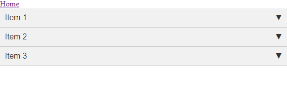
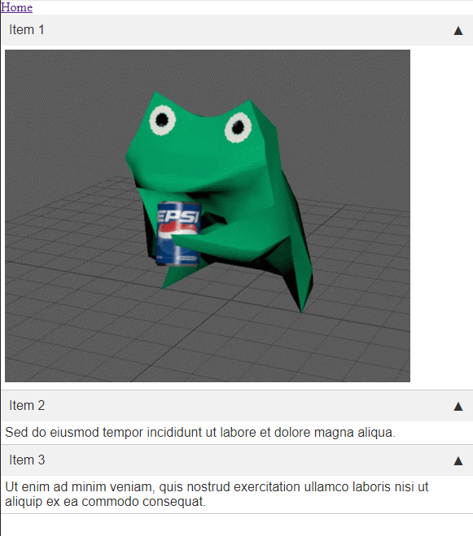

# AccordionStays Component

The `AccordionStays` component is a Vue.js component that displays an accordion-style interface, with collapsible items that can be expanded or collapsed by clicking on the item header. 

## Features

- Customizable header and content for each item
- Smooth animation when expanding and collapsing items
- Uses Vue.js reactivity system to track active items

## Props

- `items` (required): An array of objects representing each accordion item. Each object should have the following properties:
  - `header`: The header text for the item
  - `content`: The content HTML for the item
  - `active`: A boolean indicating whether the item is initially expanded or collapsed

## Events

|Name|Description|
|-|-|
| `itemToggle` | Triggered when an item is expanded or collapsed. The index of the item that was toggled is passed as an argument. |


## Example Usage

```html
<template>
  <div>
    <AccordionStays :items="items" @itemToggle="onItemToggle" />
  </div>
</template>

<script>
import AccordionStays from './AccordionStays.vue';

export default {
  components: {
    AccordionStays,
  },
  data() {
    return {
      items: [
        {
          header: 'Item 1',
          content: '</img>',
          active: false,
        },
        {
          header: 'Item 2',
          content: 'Sed do eiusmod tempor incididunt ut labore et dolore magna aliqua.',
          active: true,
        },
        {
          header: 'Item 3',
          content: 'Ut enim ad minim veniam, quis nostrud exercitation ullamco laboris nisi ut aliquip ex ea commodo consequat.',
          active: false,
        },
      ],
    };
  },
  methods: {
    onItemToggle(index) {
      this.items[index].active = !this.items[index].active
    },
  },
};
</script>
```

## Demonstration

### Closed



### Opened

