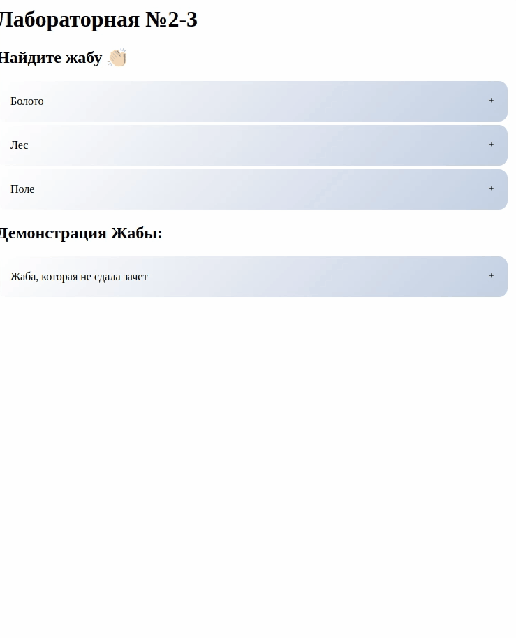

# Accordion Component:



# Props:

| name              | type              | comments                                                    |
|-------------------|-------------------|-------------------------------------------------------------|
| elems             | Array of Objects  | Object has fields title and info.                           |
| activeElems       | Array of booleans | True means that element is open, false - element is closed. |
| contentArrayIndex | Number            | Index of this accordion instance.                           |

# Emits :

updateElement is emitted on click on the title block of the element, passes an Object with fields aIndex=infoArrayIndex
and index.

# Usage Example:

```
<template>
  <AccordionComponent :infoArrayIndex=0 
                      :elems=this.elems
                      :activeElems=this.active
                      @updateElement="update($event)"/>
</template>

<script>
import AccordionComponent from '../../../components/accordionY/AccordionComponent.vue'

export default {
    namespaced: true,
    state: {
        activeElements: [
            Array.from({length: 3}, () => false),
            Array.from({length: 2}, () => true)
        ],
        accordionData: [
            [
                {
                    title: "Болото",
                    content: "О нет! Здесь нет жабы, но полно лягушек. 👀",
                },
                {
                    title: "Лес",
                    content: "Ура! Вы нашли жабу! 🤝",
                },
                {
                    title: "Поле",
                    content: "Никаких жаб. Посмотрите выше. ☝"
                }
            ],
            [
                {
                    title: "Жаба, которая не сдала зачет",
                    content: ""
                },
            ]
        ]
    }
```
