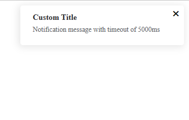

# Notifications by Kramarev

## Setup and usage

* Import and register NotificationArea component to your page  
* Pass its position on the screen through ```:position```  
Available values: *right*, *left*. Right is default
* If there's a need to hide the component from the markup use ```v-if="getNotificationsCount"```  

* Store extension description:
  * Getters:  
  
  ```js
  /**
   * Current unique id that will be used for a new notification
   * @returns { Number }
   */
  getId()
  ```

  ```js
  /**
   * Returns an array of notification's infos
   @returns { id: Number, title: String, content: String, timeout: Number } - element of the array
   */
  getNotifications()
  ```  

  ```js
  /**
   * Default notification timeout
   * @returns { Number }
   */
  getInterval()
  ```

  ```js
  /**
   * Count of notifications currently stored
   * @returns { Number }
   */
  getNotificationsCount()
  ```

  * Actions:  

  ```js
  /**
   * Deletes a notification's info from the store by its id
   @returns { message: 'PR мощный' }
   */
  deleteNotification(id)
  ```

  ```js
  /**
   * Adds a notification to the store
   * @param { title: String, content: String, timeout: Number } payload - notification's info
   */
   addNotification(payload)
  ```

* Once notification is added to the store it will be displayed on the screen  
* Notification will disappear after a timeout or by clicking on the cross

## Appeared notification


