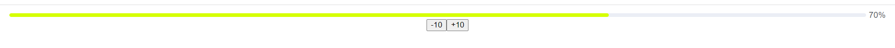

# RyaguzovProgressBar

This is Vue.js component implementing progressBar.

## ProgressBar object attributes

|Property              |Description                                          | Type  |
|:-------------------: |:---------------------------------------------------:|:-----:|
|progressValue         |Displays progress bar status                         |Number |
|intervalProgressValue |Responsible for the progressbar change interval      |Number |

## Usage
```vue
<template>
  <ProgressBar
    :progressValue="progressValue"
    :intervalProgressValue="intervalProgressValue"
    @decrement="decrement"
    @increment="increment"
  />
</template>
 
<script>
import ProgressBar from "../../../components/lab2ProgressBarRyaguzov/ProgressBar.vue";

export default {
name: "ProgressBarPage",
components: {
  ProgressBar
},
data() {
  return {
    progressValue: 40,
    intervalProgressValue: 10,
  }
},
methods: {
  decrement(value) {
    this.progressValue = Math.max(0, this.progressValue - value);
  },
  increment(value) {
    this.progressValue = Math.min(100, this.progressValue + value);
  }
}
}
</script>

<style scoped lang="less">
</style>

```
