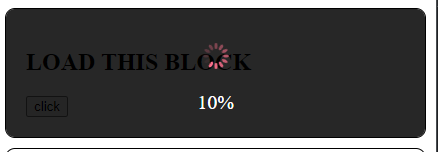
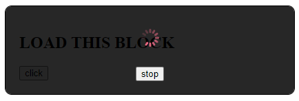

# Loader Component

## Basic usage
```vue
<template>
  <div class="loader-blocks">
    <div class="loader-blocks__block">
      <h2>LOAD THIS BLOCK</h2>
      <button @click.prevent="blocking1()">click</button>
      <LoaderComponent
          :loading="block1"
          :percents="block1Percents"
      />
    </div>
  </div>
</template>

<script>
import LoaderComponent from '../../../components/loader/Loader.vue'

export default {
  name: 'LoaderPage',
  components: {
    LoaderComponent
  },
  data () {
    return {
      block1: false,
      block1Percents: 0,
    }
  },
  methods: {
    blocking1() {
      this.block1 = true;
      this.block1Percents = 0;
      for (let i = 0; i <= 100; i++) {
        setTimeout(() => this.block1Percents = i, i * 10);
      }

      setTimeout(() => this.block1 = false, 1500)
    },
  },
}
</script>
```
### Element loader with percents

### Element loader with stop button

### Page loader with percents and stop button

___
## Loader Attributes

|Property|Description          | Type   |Default|
|:-------:|:-------------------:|:------:|:-------:|
|loading |show or not loader        |Boolean  |false        |
|percents|current loading percents or false|Number, Boolean|0|
|isGlobal|block all page or not |Boolean|false|
|showStopBtn|Show button to prevent loading|Boolean|false|
|loaderImage|Loader icon|String|''|
