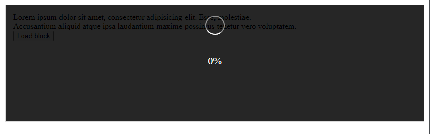
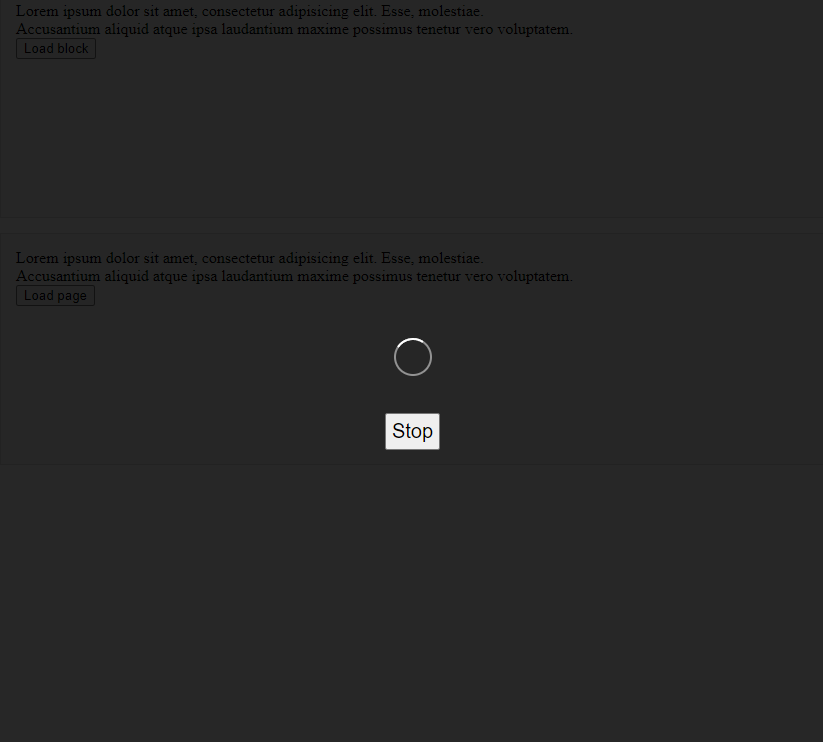

# Loader Компонет

Компонент блокирующий станицу или блок на время загрузки

## Пример использования
```vue
<template>
  <div class="loader-blocks">
    <div class="loader-blocks__block">
      <div>Lorem ipsum dolor sit amet, consectetur adipisicing elit. Esse, molestiae.</div>
      <div>Accusantium aliquid atque ipsa laudantium maxime possimus tenetur vero voluptatem.</div>

      <button @click.prevent="blocking1(3000)">Load block</button>
      <LoaderComponent
          :loading="loading1"
          :percents="loading1Value"
          showPercents
      />
    </div>
  </div>
</template>

<script>
import LoaderComponent from '../../../components/loader/Loader.vue'

export default {
  name: 'LoaderPage',
  components: {
    LoaderComponent
  },
  data () {
    return {
      loading1: false,
      loading1Value: 0,
    }
  },
  methods: {
    blocking1(time) {
      this.loading1 = true;
      this.loading1Value = 0;

      this.loaderTimeout = setTimeout(() => {
        this.loading1Value = 99;

        this.loaderTimeout = setTimeout(() => {
          this.loading1 = false
        }, 1000)
      }, time - 1000)
    }
  },
}
</script>
```
### Loader с процентом загрузки, блокирующий элемент

### Loader с кнопкой остановки, блокирующий страницу

___
## Loader Свойства

|Свойство|Описание|Тип|Значение по-умолчанию|
|:-------:|:-------------------:|:------:|:-------:|
|loading |показывать ли загрузку|Boolean|false|
|showPercents|показывать ли проценты|Boolean|false|
|percents|процент загрузки|Number|0|
|canBeStopped|показывать ли кнопку остановки|Boolean|false|
|blockPage|блокировать ли всю страницу|Boolean|false|

|Событие|Описание|
|:-------:|:--------------------:|
|stopped |нажата кнопка остановки|