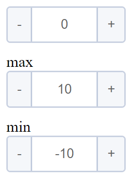
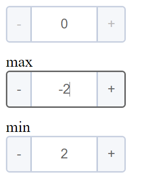

# RangeInput

This component allows to implement numeric input with minimum and maximum value restrictions 
## Basic usage

```js
<template>
  <div class="num-input-container">
    <NumberInput v-model.lazy="current" @create="setCurrent" :step="step" :max="max" :min="min" />
    max<NumberInput :value="max" @create="setMax"></NumberInput>
    min<NumberInput :value="min" @create="setMin"></NumberInput>
  </div>
</template>

<script>
import NumberInput from "../../../components/number-input/NumberInput.vue"
import { mapGetters, mapActions } from 'vuex'
export default {
  components: {
    NumberInput,
  },
  methods: {
    ...mapActions('range',
      {
        setMax: 'setMaxValue',
        setMin: 'setMinValue',
        setCurrent:'setCurrentValue'
      }),
  },
  computed: {
    ...mapGetters('range',
      {
        current:'getCurrent',
        max: 'getMax',
        min: 'getMin',
        step: 'getStep'
      }),
  }
}
</script>


  ```
## RangeInput component will look like this:


