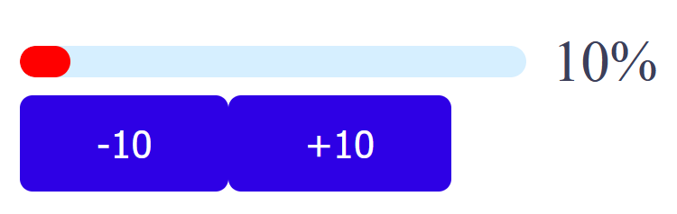
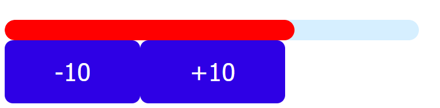
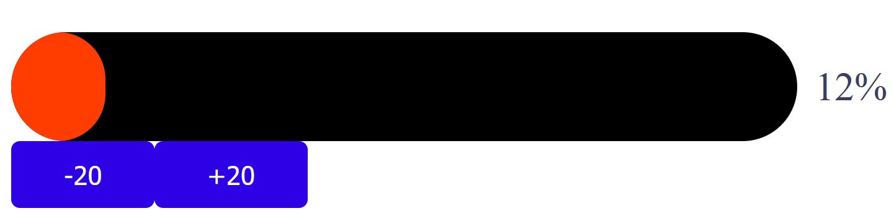
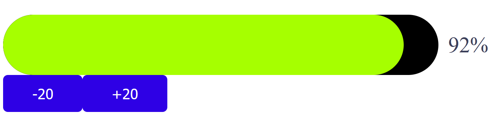

# Progress

## Basic usage
```vue
<template>
  <div class="about">
    <h1>Progress</h1>
    <div style="max-width: 500px;">
      <ProgressBar
        v-model="progressOptions4"
        :showTip="true"
        :height="50"
        :colorFunc=color
        :innerStrokeColor="'black'"
        :width="400"
      > 
      </ProgressBar>
      <Button @click="() => decrease4(20)" >
        -20
      </Button>
      <Button @click="() => increase4(20)" >
        +20
      </Button>
    </div>
  </div>
</template>

<script>
import ProgressBar from "../../../components/progress/Progress.vue";
  import Button from "../../../components/button/Button.vue";
    export default {
      name: "SelectPage",
      components: {
        ProgressBar,
        Button
      },
      data() {
        return {
          progressOptions4: 12
        }
      },
      methods: {
        increase4(change) {
          this.progressOptions4 = this.increase(this.progressOptions4, change);
        },
        decrease4(change) {
          this.progressOptions4 = this.decrease(this.progressOptions4, change);
        },
        increase(value, change) {
          value += change;
          if(value > 100) {
            value = 100;
          }
          return value;
        },
        decrease(value, change) {
          value -= change;
          if(value < 0){
            value = 0;
          }
          return value;
        },
        color(percentage) {
          var second = 13 + percentage * 4;
          if(second > 255) {
            var first = 350 - percentage * 2;
            return `rgb(${first}, 255, 0)`;
          }
          return `rgb(255, ${second}, 0)`;
        },
      }
    }
</script>

<style></style>
```
### Basic progress

### Progress without tip

### Progress with all props


___
## Select Attributes

|Attribute|Description          | Type   |Default|
|:-------:|:-------------------:|:------:|:-------:|
|v-model  |binding value        |Number  |0        |
|height |Height of the progress bar in pixels|Number|10|
|width|Width of the progress bar in pixels|Number|200|
|showTip|Show tip text after the progress bar|boolean|true|
|colorFunc|Color change function|Function|null|
|innerStrokeColor|Background color of the progress bar|String|#d6efff|