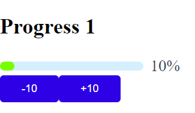
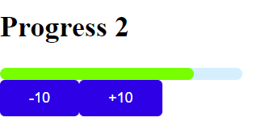
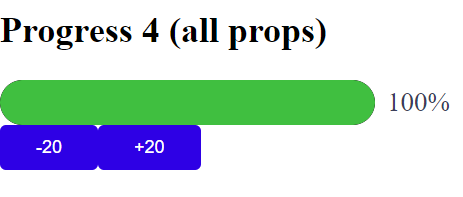

# Progress

Компонент визуализирующий значение от 0 до 100

## Атрибуты

|Attribute|Description          | Type   |Default|
|:-------:|:-------------------:|:------:|:-------:|
|v-model  |binding value        |Number  |0        |
|height |Height of the progress bar in pixels|Number|10|
|width|Width of the progress bar in pixels|Number|200|
|showTip|Show tip text after the progress bar|boolean|true|
|colorFunc|Color change function|Function|null|
|innerStrokeColor|Background color of the progress bar|String|#d6efff|

## Использование
```vue
<template>
  <div class="about">
    <h2>Progress 4 (all props)</h2>
    <ProgressBar
        v-model="progressOptions4"
        :showTip="true"
        :height="30"
        :colorFunc=color
        :innerStrokeColor="'black'"
        :width="300"
        ref="ProgressBar4"
    >
    </ProgressBar>
    <Button @click="() => this.$refs.ProgressBar4.decrease(20)">
      -20
    </Button>
    <Button @click="() => this.$refs.ProgressBar4.increase(20)">
      +20
    </Button>
  </div>
</template>

<script>
import ProgressBar from "../../../components/progress/Progress.vue";
  import Button from "../../../components/button/Button.vue";
    export default {
      name: "SelectPage",
      components: {
        ProgressBar,
        Button
      },
      data() {
        return {
          progressOptions4: 12
        }
      },
      methods: {
        methods: {
          color(percentage) {
            return `hsl(${percentage * 1.2} 50% 50%)`;
          },
      }
    }
</script>

<style></style>
```
### Примеры




