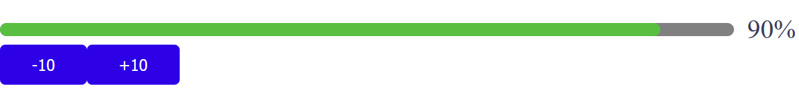
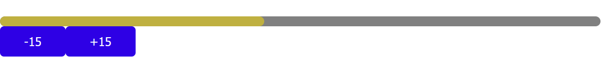
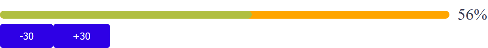

# Прогресс линия

## Пример использования со всеми параметрами
```vue
<template>
  <ProgressShl
    v-model="thirdProgress"
    :progressHeight="30"
    :progressWidth="500"
    :timingFunction="'cubic-bezier(.29, 1.01, 1, -0.68)'"
    :changeTime="1"
    :innerStrokeColor="'#ffa500'"
    :colorFunc=CustomColorMethod
    ref="ProgressThird"
  />
</template>

<script>
  import ButtonShl from "../../../components/button/Button.vue";
  import ProgressShl from "../../../components/progressShel/ProgressShel.vue";
  
  export default {
    name: "SelectPage",
    components: {
      ProgressShl,
      ButtonShl
    },
    data() {
      return {
        thirdProgress: 78
      }
    },
    methods: {
      CustomColorMethod(percentage) {
        if (percentage < 30) {
          return '#909399'
        }
        if (percentage < 70) {
          return '#e6a23c'
        }
        return '#67c23a'
      }
    }
  }
</script>
```
## Параметры

|Attribute|Description          | Type   |Default|
|:-------:|:-------------------:|:------:|:-------:|
|value  |binding value        |Number  |0        |
|progressHeight |Height of the progress bar in pixels|Number|10px|
|progressWidth|Width of the progress bar in pixels|Number|100%|
|showPercentage|Show tip text after the progress bar|boolean|true|
|colorFunc|Color change function|Function|hsl(${currValue * 1.2} 50% 50%)|
|innerStrokeColor|Background color of the progress bar|String|linear|
|changeTime|The amount of time in milliseconds to animate one step|Number|0.3|
|timingFunction|The transition timing function to use for the CSS transition|String|linear|

___

### Базовая прогресс линия (без параметров)

### Прогресс линия без отображения процентов

### Прогресс линия с измененным цветом подложки

### Примеры прогресс линий с разной скоростью анимации и разной анимационной функцией


