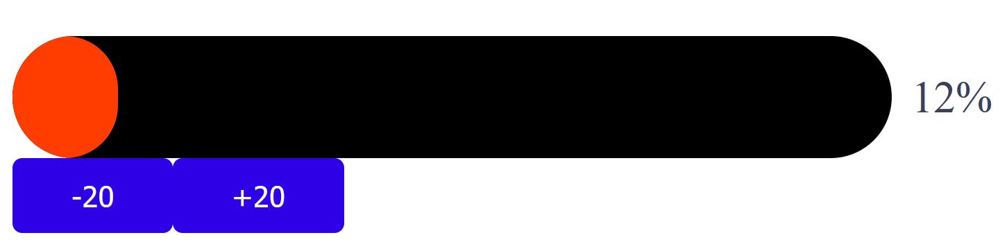
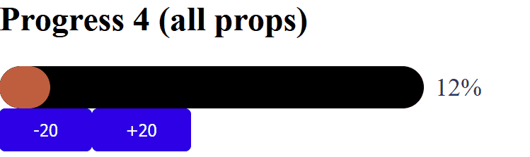
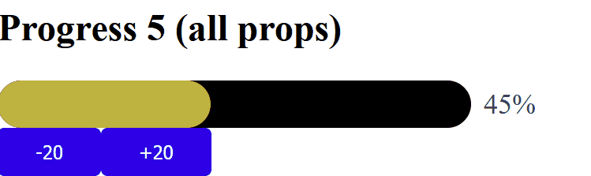

# Progress

## Basic usage
```vue
<template>
  <div class="about">
    <h1>Progress</h1>
    <div style="max-width: 500px;">
      <ProgressBar
        v-model="progressOptions4"
        :showTip="true"
        :height="50"
        :colorFunc=color
        :innerStrokeColor="'black'"
        :width="400"
        :changeTime="1"
        :timingFunction="'cubic-bezier(.29, 1.01, 1, -0.68)'"
        ref="ProgressBar4"
      > 
      </ProgressBar>
      <Button @click="() => this.$refs.ProgressBar4.decrease(20)" >
        -20
      </Button>
      <Button @click="() => this.$refs.ProgressBar4.increase(20)" >
        +20
      </Button>
    </div>
  </div>
</template>

<script>
import ProgressBar from "../../../components/progress/Progress.vue";
  import Button from "../../../components/button/Button.vue";
    export default {
      name: "SelectPage",
      components: {
        ProgressBar,
        Button
      },
      data() {
        return {
          progressOptions4: 12
        }
      },
      methods: {
        color(percentage) {
          return `hsl(${percentage * 1.2} 50% 50%)`;
        }
      }
    }
</script>

<style></style>
```
## Select Attributes

|Attribute|Description          | Type   |Default|
|:-------:|:-------------------:|:------:|:-------:|
|v-model  |binding value        |Number  |0        |
|height |Height of the progress bar in pixels|Number|10|
|width|Width of the progress bar in pixels|Number|200|
|showTip|Show tip text after the progress bar|boolean|true|
|colorFunc|Color change function|Function|null|
|innerStrokeColor|Background color of the progress bar|String|#d6efff|
|changeTime|The amount of time in milliseconds to animate one step|Number|0.3|
|timingFunction|The transition timing function to use for the CSS transition|String|linear|

___

### Basic progress

### Progress without tip

### Progress with all props




