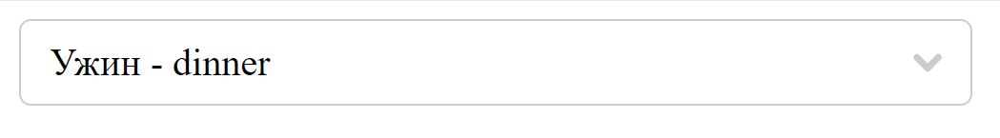
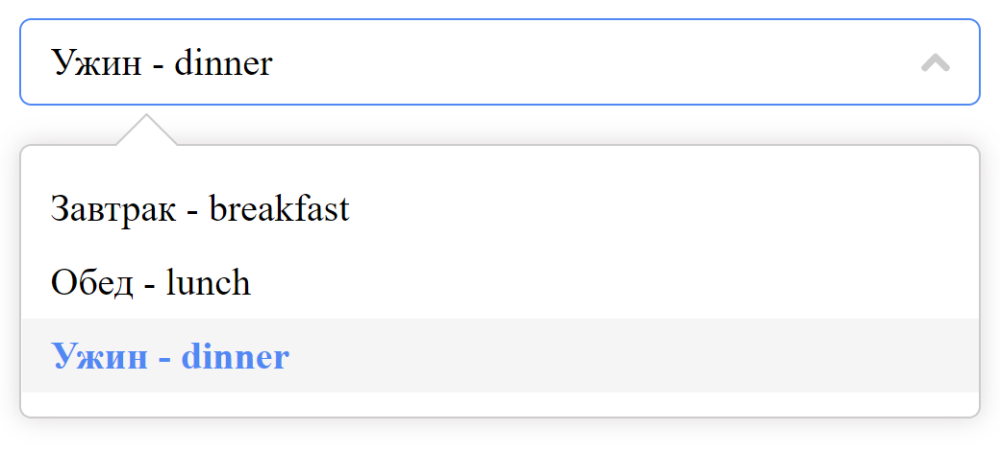
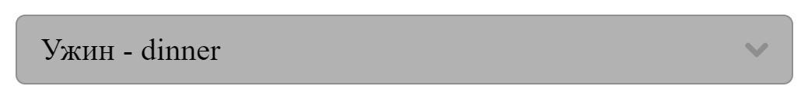

# Select

### When there are plenty of options, use a drop-down menu to display and select desired ones.

## Basic usage
```vue
<template>
  <div id="app" style="max-width: 400px">
    <SelectComponent
      v-model="selectedOption"
      :options="meals"
      :close-on-select="false"
      :disabled="false"
      :custom-label="customLabel"
      no-data-message="Доступных приёмов пищи нет"
      placeholder="Выберите приём пищи"
    >
    </SelectComponent>
  </div>
</template>

<script>
import SelectComponent from "./components/SelectComponent.vue";

export default {
  name: "App",
  components: {
    SelectComponent,
  },

  data() {
    return {
      selectedOption: "dinner",
    };
  },

  methods: {
    customLabel(option)
    {
      return (`${option.name} - ${option.value}`);
    }
  },

  computed: {
    meals() {
      return [
        {
          name: "Завтрак",
          value: "breakfast",
        },
        {
          name: "Обед",
          value: "lunch",
        },
        {
          name: "Ужин",
          value: "dinner",
        },
      ];
    },
  },
};
</script>

<style></style>
```
### Closed Select

### Opened Select


### Select always hides when there is a click outside of it
___
## Disabled select

___
## Select Attributes

|Attribute|Description          | Type   | Accepted Values|  Default|
|:-------:|:-------------------:|:------:|:--------------:|:-------:|
|v-model  |binding value        |String  |—               |—        |
|disabled |whether Select is disabled|boolean|—|false|
|option-key|unique identity key name for value|string|—|value|
|placeholder|placeholder|string|—|-|
|no-data-message|displayed text when there is no options|string|—|No Data|
|close-on-select|Select automatically hides options when click occurred on one of them|boolean|—|true|
|tabindex|determine  relative ordering of Select for sequential focus navigation|number| >= 0| 0|
custom-label|custom label for options method|function|—| return option.name|

___
## Select Events
|Event Name|Description|Parameters|
|:--:|:--:|:--:|
|on-select-set-new-option|triggers when selected new option| current selected option|
|on-select-set-empty|triggers when unselected option, current option is empty|last selected option|
|visible-change|triggers when the dropdown appears/disappears|true when it appears, and false otherwise