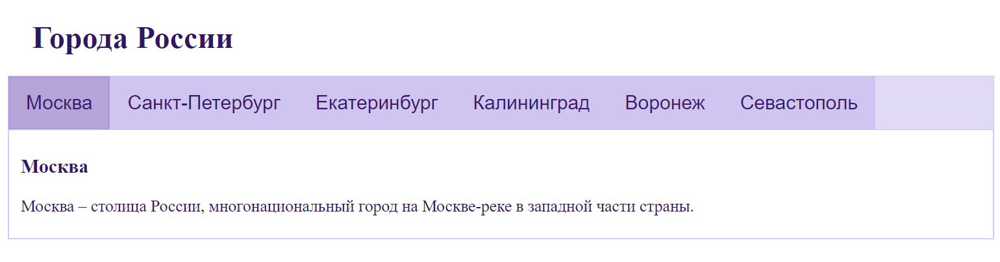
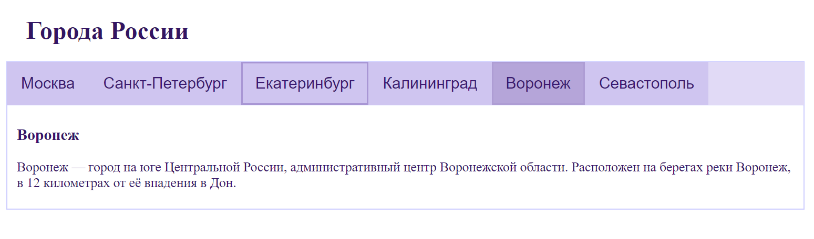

# Tab
## Basic usage
```js
<template>
  <div>
    <h1 class="myText">Города России</h1>
    <Tab :content="content"/>
  </div>
</template>

<script >
  import Tab from "../../components/tab/Tab.vue"
  export default {
    components:{
      Tab
    },
    data() {
      return {
        content:
        [
          ["Москва", "Москва – столица России, многонациональный город на Москве-реке в западной части страны."], 
          ["Санкт-Петербург", "Санкт-Петербург – русский портовый город на побережье Балтийского моря, который в течение двух веков служил столицей Российской империи.",], 
          ["Екатеринбург", "Екатеринбург – город в России, расположенный к востоку от Уральских гор."], 
          ["Калининград", "Калининград – город в России, расположенный между Польшей и Литвой на побережье Балтийского моря."],
          ["Воронеж", "Воронеж — город на юге Центральной России, административный центр Воронежской области. Расположен на берегах реки Воронеж, в 12 километрах от её впадения в Дон."],
          ["Севастополь", "Севастополь — город на юго-западе Крымского полуострова, на побережье Чёрного моря."],
        ]
      }
    },
  }
</script>
```

## Resulting Tab component will look like this:
### Tab changed

### Regular Tab with mouse hover


## Tab Attributes
|Attribute|Description|Type|Accepted Values|Default|
|:-:|:-:|:-:|:-:|:-:|
|content|data source|Array|—|—|