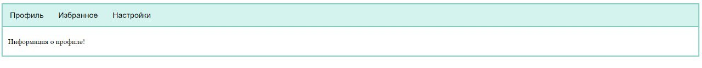

# Tabs

This component allows to show information from tabs 
## Usage
```js
<template>
  <div>
    <MyTabs :tabs="tabs" :description="description"/>
  </div>
</template>
<script>
import MyTabs from "../../components/tabs/MyTabs.vue"
export default {
  components: {
    MyTabs
  },
  data() {
      return {
        tabs:[{name: 'Профиль', content: 'Информация о профиле!'},
        {name: 'Избранное', content: 'Информация об избранном!'},
        {name: 'Настройки', content: 'Информация о настройках!'}
        ]
      }
  },
}
</script>
```
## Tabs component will look like this:


## Tabs Attributes

|Attribute|Description|Type|Accepted Values|Default|Required|
|:-:|:-:|:-:|:-:|:-:|:-:|
|tabs|data source|Array|—|—|True|
|content|content|String|—|—|True|

___
## Tabs Events
|Event Name|Description|Parameters|
|:-:|:-:|:-:|
|switched|triggers when tab was switched|content - tab content|
___